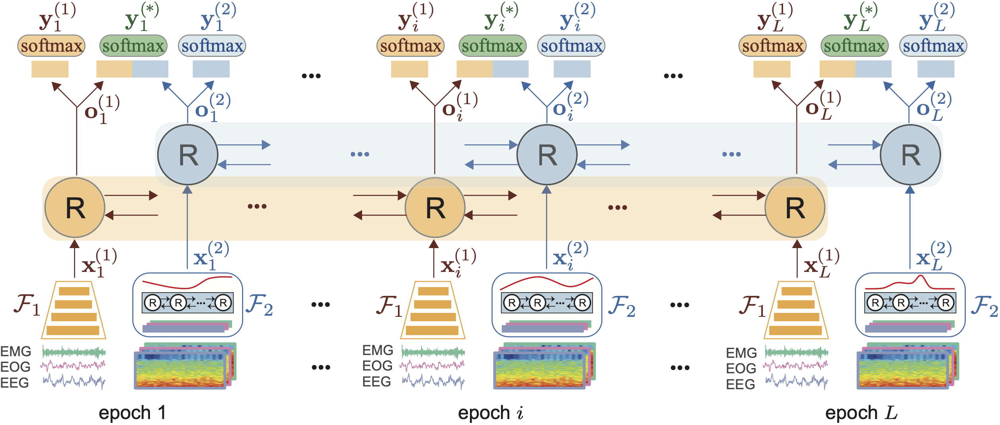
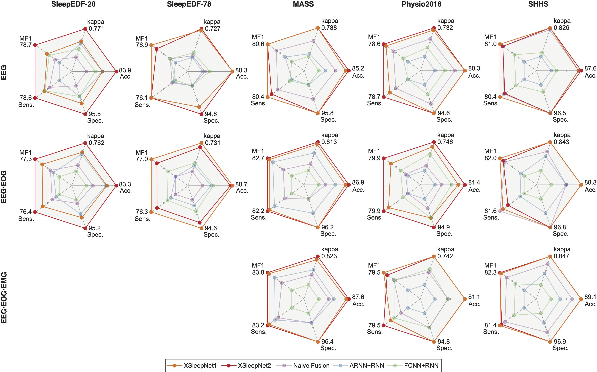

# XSleepNet
- Huy Phan, Oliver Y. Chén, Minh C. Tran, Philipp Koch, Alfred Mertins, and Maarten De Vos. [__XSleepNet: Multi-View Sequential Model for Automatic Sleep Staging.__](https://ieeexplore.ieee.org/abstract/document/9392272) _IEEE Transactions on Pattern Analysis and Machine Intelligence (TPAMI)_, 2021. [[Preprint]](https://arxiv.org/abs/2007.05492)  *(in press)*

 **\*\*NOTE: the code is not completed yet. Currently, only setups for MASS and SleepEDF-20 database are availble, others will be updated soon.**

These are source code and experimental setup for [SHHS](https://sleepdata.org/datasets/shhs), [MASS](https://massdb.herokuapp.com/en/), [Physionet 2018](https://physionet.org/content/challenge-2018/1.0.0/), [Sleep-EDF Explanded](https://www.physionet.org/content/sleep-edfx/1.0.0/) (both version with 20 and 78 subjects) databases. We try to keep the experiments separately for each database to ease exploring them invididually.

The pretrained models can be downloaded from [Part 1/2](https://zenodo.org/record/5809496) and [Part 2/2](https://zenodo.org/record/5809511) to be used in combination with the code to re-produce the results in the paper. 

How to use:
-------------
1. Download the databases. This may require to apply for licences (for example, [MASS](https://massdb.herokuapp.com/en/) and [SHHS](https://sleepdata.org/datasets/shhs)). Information on how to obtain it can be found in the corresponding website. WE recommend to start with Sleep-EDF Expanded database which is the smallest one. 
2. Data preparation
- Change the current directory corresponding to the database you want to experiment with
- Run data preparation steps in `run_all.m`
3. Network training and testing
- Change directory to a specific network in `./tensorflow_nets/`, for example `./tensorflow_nets/xsleepnet2/`
- Run a bash script, e.g. `bash run_1chan.sh`. This may take a long time depending on the resouces available.  
4. Evaluation
- Execute the steps in `run_all.m` to compute performance metrics.

Environment:
-------------
- Matlab v7.3 (for data preparation)
- Python3.7
- Tensorflow GPU 1.x (x >= 3) (for network training and evaluation)
- numpy
- scipy
- h5py
- sklearn 

Some results:
-------------
Sleep scoring results with the networks across the experimental databases:

Contact:
-------------
Huy Phan 

School of Electronic Engineering and Computer Science  
Queen Mary University of London  
Email: h.phan{at}qmul.ac.uk  

License
-------------
MIT © Huy Phan
